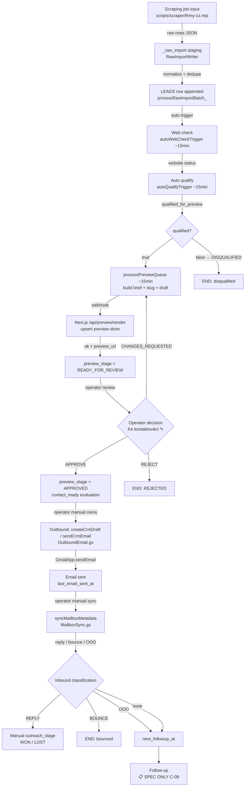
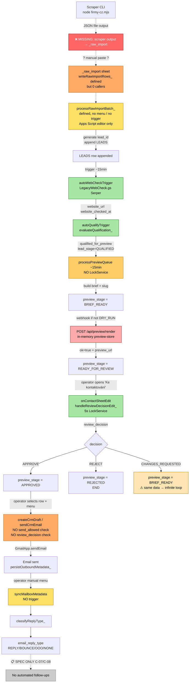

# Fáze 8 — Funnel Flow Audit (end-to-end)

> **Cíl:** Zmapovat skutečný tok leadu od scrapingu po post-send stavy. Najít race conditions, missing pieces, drift mezi spec a runtime.
> **Scope:** Apps Script funkce + frontend views/routes + relevantní docs/contracts.
> **Baseline:** `origin/main` @ `620b786` (po merge PR #45 Phase 7).
> **Audit datum:** 2026-04-25
> **Mód:** AUDIT-ONLY — žádné změny produkčního kódu, žádný deploy. Žádné plné secrety ani reálné PII v dokumentu.

**Status legenda:**
- ✅ **LIVE VERIFIED** — fungování ověřeno v PROD operations
- 🟢 **TEST VERIFIED** — ověřeno v TEST runtime (kód běžel proti TEST sheetu)
- 🔵 **LOCAL VERIFIED** — ověřeno mock/unit testem (kód volán v test scriptu)
- 📋 **SPEC ONLY** — kontrakt existuje (docs/contracts), runtime neimplementován
- ❌ **NOT IMPLEMENTED** — ani spec ani runtime
- ⚪ **NOT VERIFIED** — kód existuje, ale nelze ověřit ze zdrojáků

---

## A. Mapa toku

### A.1 Intended end-to-end flow (per docs CS1/CS2/A-stream/B-stream/C-stream)

### A.2 Actual implemented flow (state of `main` @ `620b786`)

### A.3 Per-step inventory

| # | Krok | Runtime funkce | Vstup | Výstup | State write | Idempotence | Failure handling | Observability | Status | Cross-ref |
|---|------|----------------|-------|--------|--------------|-------------|-------------------|---------------|--------|-----------|
| 1 | Scrape | `scripts/scraper/firmy-cz.mjs` (CLI, manual) | A-01 ScrapingJobInput JSON | A-02 RawImportRow[] JSON | local file | per-record retry off; per-listing fail = job_status=failed | per-record try/catch; per-listing fatal | stdout summary + counts | 🔵 LOCAL VERIFIED (fixture run); doc 24:124-128 zmiňuje live test 2026-04-11 | — |
| 2 | Persist scraper → `_raw_import` | **NEUVEDEN — gap** | scraper JSON | sheet rows | (none) | n/a | n/a | n/a | ❌ NOT IMPLEMENTED | **FF-001** |
| 3 | Batch ingest pipeline | `RawImportWriter.gs:processRawImportBatch_` | rows in `_raw_import` (status=raw) | LEADS appends + raw row status updates | `_raw_import` + LEADS append-only | partially: dedupe checks LEADS index; resume after partial fail OK (status=raw rows reprocesed) | per-row try/catch; status=error on normalize fail | `aswLog_` + return stats; A-09 ingest report | 🔵 LOCAL VERIFIED (test-ingest-runtime.mjs 2026-04: 7→1 rej / 2 dup / 4 imp); ⚠ **no menu/trigger** | **FF-002** |
| 4 | Web check (auto) | `AutoWebCheckHook.gs:autoWebCheckTrigger`/`runAutoWebCheck_` | LEADS rows w/ empty `website_url` | `website_url`, `website_status`, `website_checked_at` | LEADS in-place; LockService 5s | filter `website_checked_at` empty = double-run guard | per-row try/catch; SERPER_API_KEY error → blocks batch | aswLog_; lockFailed flag | ⚪ NOT VERIFIED in PROD (TEST verified per task A-06) | — |
| 5 | Auto qualify | `AutoQualifyHook.gs:autoQualifyTrigger`/`runAutoQualify_` | LEADS rows web-checked, no `lead_stage` | `lead_stage`, `qualified_for_preview`, `qualification_reason` | LEADS in-place; LockService 5s | filter `lead_stage` empty | per-row try/catch | aswLog_ | ⚪ NOT VERIFIED in PROD (TEST verified per A-07) | — |
| 6 | Process preview queue | `PreviewPipeline.gs:processPreviewQueue` (15-min trigger) | LEADS rows `qualified=true` + eligible stage | `template_type`, `preview_brief_json`, `preview_slug`, `email_subject_draft`/`email_body_draft` (if `send_allowed`), `preview_stage`, webhook call | LEADS in-place; **NO LockService** | filter eligible stages; brief rebuild idempotent (same data → same brief); webhook re-call OK on retry of FAILED | per-row try/catch; webhook err → `preview_stage=FAILED + preview_error` | aswLog_ INFO/ERROR; `last_processed_at` | ⚪ NOT VERIFIED in PROD (TEST/pilot via runWebhookPilotTest) | **FF-003** (race) |
| 7 | Preview render | `crm-frontend/src/app/api/preview/render/route.ts:POST` | webhook payload | preview-store upsert + `MinimalRenderResponseOk` | in-memory Map (not persistent) | by `preview_slug`; same slug overwrites | timing-safe header check, validateRenderRequest, fail JSON | `console.log` Vercel logs | ⚪ NOT VERIFIED in PROD; LOCAL test fixture | **FF-004** (cross-ref IN-014) |
| 8 | Render preview page | `crm-frontend/src/app/preview/[slug]/page.tsx` | preview-store record OR mock fixture | HTML render | none | get-only | `notFound()` if no record/fixture | request log | ⚪ NOT VERIFIED in PROD | cross-ref SEC-009 |
| 9 | Operator review | `ContactSheet.gs:onContactSheetEdit` → `handleReviewDecisionEdit_` | onEdit event v "Ke kontaktování" col 12 | `review_decision`, `reviewed_at`, `reviewed_by`, `preview_stage` | LEADS in-place; LockService 5s; atomic 4-cell write | guard: only `READY_FOR_REVIEW`; per decision deterministic | guards return early w/ note on cell; revert humanized value on fail | aswLog_ INFO/WARN/ERROR per guard; cell note for operator | 🟢 TEST VERIFIED (B6 task record TEST run 2026-04-24, 3/3 scenarios) | **FF-005** (CHANGES_REQUESTED loop) |
| 10 | Frontend write-back (subset) | `crm-frontend/src/lib/google/apps-script-writer.ts` → `WebAppEndpoint.gs:doPost` | PATCH `/api/leads/[id]/update` | `outreach_stage`, `next_action`, `last_contact_at`, `next_followup_at`, `sales_note` | LEADS in-place; LockService 5s | per-field write idempotent; identity check by lead_id + business_name | error in body, generic on FE (cross-ref IN-006) | aswLog_ + Vercel logs | ⚪ NOT VERIFIED in PROD; cross-ref Phase 5 IN findings | — |
| 11 | Outbound draft/send | `OutboundEmail.gs:executeCrmOutbound_` (manual menu) | active row in "Ke kontaktování" | `last_email_sent_at`, `email_thread_id`, `email_message_id`, `email_sync_status=DRAFT_CREATED/SENT` | LEADS in-place + Gmail draft/sent | double-send within `OUTBOUND_DOUBLE_SEND_MINUTES` → confirmation prompt only (not hard block) | guards: stage WON/LOST, identity, valid email, valid subject/body; persist on Gmail success only | aswLog_ INFO/ERROR | ⚪ NOT VERIFIED in PROD | **FF-006** (no send_allowed/review check), **FF-007** (no hard block) |
| 12 | Mailbox sync | `MailboxSync.gs:syncMailboxMetadata` (manual menu) | LEADS rows w/ `email_sync_status` | `email_thread_id`, `email_reply_type`, `last_email_received_at`, etc. | LEADS in-place | filter exact match (`EMAIL_SYNC_REQUIRE_EXACT_MATCH=true`) | per-lead try/catch; classifyReplyType_ deterministic | aswLog_ | ⚪ NOT VERIFIED; manual run only — **NO TRIGGER** | **FF-008** |
| 13 | Reply / bounce / OOO classification | `MailboxSync.gs:classifyReplyType_` | Gmail message | `email_reply_type` enum | embedded in step 12 | deterministic | n/a | aswLog_ | (sub-step) | — |
| 14 | Sendability gate | **C-04 SPEC ONLY** | — | — | — | — | — | — | 📋 SPEC ONLY | **FF-009** |
| 15 | Outbound queue + payload | **C-05 SPEC ONLY** | — | — | — | — | — | — | 📋 SPEC ONLY | **FF-010** |
| 16 | Provider abstraction | **C-06 SPEC ONLY** | — | — | — | — | — | — | 📋 SPEC ONLY | **FF-011** |
| 17 | Inbound event ingest | **C-07 SPEC ONLY** | — | — | — | — | — | — | 📋 SPEC ONLY | **FF-012** |
| 18 | Follow-up engine | **C-08 SPEC ONLY** | — | — | — | — | — | — | 📋 SPEC ONLY | **FF-013** |
| 19 | Exception queue (HITL) | **C-09 SPEC ONLY** | — | — | — | — | — | — | 📋 SPEC ONLY | — |
| 20 | Performance report | **C-10 SPEC ONLY** | — | — | — | — | — | — | 📋 SPEC ONLY (related: A-09 IngestReport.gs runtime — pouze ingest scope) | — |
| 21 | Config / kill switch / feature flags | **C-11 SPEC ONLY** | — | — | — | — | — | — | 📋 SPEC ONLY (DRY_RUN flag v Config.gs je jediný runtime "feature flag") | **FF-014** |

### A.4 Lifecycle state machines per row (drift)

LEADS row carries **4 separate state machines** + 1 spec-only:

| Sloupec | Definováno v | Hodnoty (runtime) | Owner |
|---------|--------------|-------------------|-------|
| `lead_stage` | `Config.gs:170-177` | `NEW`, `QUALIFIED`, `DISQUALIFIED`, `REVIEW`, `IN_PIPELINE`, `PREVIEW_SENT` | A-stream + B-stream |
| `preview_stage` | `Config.gs:141-154` | `NOT_STARTED`, `BRIEF_READY`, `GENERATING`, `READY_FOR_REVIEW`, `APPROVED`, `REJECTED`, `FAILED` + 4 legacy | B-stream |
| `outreach_stage` | `crm-frontend/src/lib/config.ts:38-45` | `NOT_CONTACTED`, `DRAFT_READY`, `CONTACTED`, `RESPONDED`, `WON`, `LOST` (CZ labels) | C-stream / FE |
| `email_sync_status` | `Config.gs:222-231` | `NOT_LINKED`, `NOT_FOUND`, `REVIEW`, `DRAFT_CREATED`, `SENT`, `LINKED`, `REPLIED`, `ERROR` | MailboxSync |
| **`lifecycle_state`** | `docs/30-task-records/CS1.md` | (spec) consolidated state | **NOT IMPLEMENTED** |

**Důsledek:** Operátor / dev musí cross-checkovat 4 sloupce, aby zjistil "co se s leadem děje". CS1 spec definovala kanonický `lifecycle_state` ale runtime ho neenforcuje. Cross-ref **FF-015**.

---

## B. Přechod po přechodu

### Přechod B.1: scraper → `_raw_import`

- **Funkce:** žádná (gap mezi `firmy-cz.mjs` výstupem a `writeRawImportRows_`)
- **Selhání uprostřed:** N/A — krok neexistuje
- **Idempotence:** N/A
- **Logging:** N/A
- **Rollback:** N/A
- **Status:** ❌ NOT IMPLEMENTED → **FF-001**

### Přechod B.2: `_raw_import` → LEADS (`processRawImportBatch_`)

- **Funkce:** `RawImportWriter.gs:processRawImportBatch_` ale **nikde nevolaná** mimo test scriptu
- **Selhání uprostřed:** per-row try/catch; status update na error v `_raw_import`. LEADS append je per-row atomic (1 row write). Pokud script-execution timeout (6 min) přeruší batch, neprocessované rows zůstanou status=raw a další run je dokončí — částečná idempotence ✅.
- **Idempotence:** ✅ status=raw filter prevencí dvojího importu. Pokud test reruns na stejných rows, dedupe by je odchytil (HARD_DUP_*).
- **Logging:** `aswLog_` per stage (normalize/dedupe/import) + souhrnný stats JSON; A-09 ingest report
- **Rollback:** žádný — append-only do LEADS. Manual revert by vyžadoval delete řádků v LEADS + reset `_raw_import` row na `raw`.
- **Status:** 🔵 LOCAL VERIFIED (test-ingest-runtime.mjs); ⚠ no production trigger — **FF-002**

### Přechod B.3: LEADS append → web check (auto trigger)

- **Funkce:** `autoWebCheckTrigger` (15-min) → `runAutoWebCheck_` → `runAutoWebCheckInner_`
- **Selhání uprostřed:** per-row try/catch; LockService(5s) chrání paralelní spuštění; SERPER_API_KEY missing → blokuje celý batch (returns early)
- **Idempotence:** ✅ filter `website_checked_at` empty = guard proti dvojímu checku
- **Logging:** `aswLog_` per row + lockFailed/headerMismatch/noApiKey markers
- **Rollback:** žádný — `website_checked_at` zůstane jako "checked, no result"; manual reset by vyžadoval clear sloupce
- **Status:** ⚪ NOT VERIFIED v PROD; trigger code 🟢 TEST VERIFIED per A-06

### Přechod B.4: web-checked → auto qualify (auto trigger)

- **Funkce:** `autoQualifyTrigger` (15-min) → `runAutoQualify_`
- **Selhání uprostřed:** per-row try/catch; LockService(5s)
- **Idempotence:** ✅ filter `lead_stage` empty
- **Logging:** `aswLog_` per row
- **Rollback:** N/A — manual clear sloupců
- **Status:** ⚪ NOT VERIFIED v PROD; 🟢 TEST VERIFIED per A-07

### Přechod B.5: qualified → preview brief (auto trigger)

- **Funkce:** `processPreviewQueue` (15-min)
- **Selhání uprostřed:** per-row try/catch nastavuje `preview_stage=FAILED + preview_error`. Webhook fail = stejný path. **NO LockService** → 2 paralelní 15-min ticks mohou číst stejné rows + obě zapisovat → last-write-wins.
- **Idempotence:** middleground — brief je deterministický (idempotent), ale **opakované webhook calls** posílají stejný payload (preview-store upsertne stejný slug). FAILED → re-eligible v dalším runu.
- **Logging:** `aswLog_` INFO per webhook OK, ERROR per fail; `last_processed_at` per row
- **Rollback:** žádný — manual reset `preview_stage` na BRIEF_READY a re-run
- **Status:** ⚪ NOT VERIFIED v PROD; race risk **FF-003**

### Přechod B.6: webhook → /api/preview/render

- **Funkce:** `crm-frontend/src/app/api/preview/render/route.ts:POST`
- **Selhání uprostřed:** validate first, putPreviewRecord later → partial state nemožný (in-memory atomic upsert). Pokud Vercel function crashes po validate před putPreviewRecord, preview-store nebyla updatována → další attempt má stejnou consistency
- **Idempotence:** ✅ slug-based upsert; same slug overwrites. Apps Script side: po failed httpCode retries v dalším run cyklu.
- **Logging:** `console.log` (Vercel runtime logs); GAS-side `aswLog_`
- **Rollback:** N/A — restart Vercel deploy = preview-store wipe (cross-ref IN-014)
- **Status:** ⚪ NOT VERIFIED v PROD; **FF-004**

### Přechod B.7: READY_FOR_REVIEW → APPROVED/REJECTED/BRIEF_READY (operator review)

- **Funkce:** `ContactSheet.gs:onContactSheetEdit` → `handleReviewDecisionEdit_`
- **Selhání uprostřed:** atomický write 4 cell pod single 5s lock. Pokud sheet API fail v půlce 4 setValue calls (mid-stage flush), state v LEADS bude inkonzistentní (např. `review_decision=APPROVE` ale `preview_stage` ještě READY_FOR_REVIEW). `setValue` je sync per call, takže mid-fail je extreme edge case.
- **Idempotence:** ✅ guard `preview_stage=READY_FOR_REVIEW` — dvojí klik / dvojí trigger nezpůsobí 2× zápis. Po first write je stage APPROVED a guard příště odmítne.
- **Logging:** `aswLog_` INFO/WARN/ERROR; cell note v Sheets pro operátora
- **Rollback:** manual: operator may CHANGES_REQUESTED → BRIEF_READY → re-renders. Pro full revert APPROVED na READY_FOR_REVIEW je potřeba ručně edit `preview_stage` v LEADS.
- **CHANGES_REQUESTED loop:** decision → BRIEF_READY → eligibilní pro `processPreviewQueue` v dalším 15-min ticku. Pokud source data se nemění, **regenerated brief je identický** → re-renders ten samý preview → operator vidí to samé → CHANGES_REQUESTED znova → infinite loop. Spec/contract neřeší jak nutit operátora změnit zdrojová data.
- **Status:** 🟢 TEST VERIFIED B-06 (2026-04-24, 3/3 scenarios v TEST sheetu) → **FF-005**

### Přechod B.8: APPROVED → outbound (manual menu)

- **Funkce:** `OutboundEmail.gs:executeCrmOutbound_('DRAFT'/'SEND')`
- **Selhání uprostřed:** Gmail API fail → return error, žádný persist. Identity guard, double-send guard, won/lost guard. Pokud Gmail send succeeds ale persist v `persistOutboundMetadata_` fails, email is sent ale LEADS state nereflektuje → silent inconsistency.
- **Idempotence:** ❌ **double-send guard je pouze prompt** (`OUTBOUND_DOUBLE_SEND_MINUTES`), operator může potvrdit a poslat 2× během minut. Žádný hard block.
- **Logging:** `aswLog_` INFO per draft/send; UI alert
- **Rollback:** N/A — Gmail send je permanentní; draft může být smazán manuálně
- **Guards (per code):**
  - ✅ valid email
  - ✅ non-empty subject + body
  - ✅ valid CRM row reference (`crmRowNum`)
  - ✅ stage NOT (`won`, `lost`) — case-insensitive
  - ✅ identity verification (business_name match)
  - ✅ double-send prompt (not hard block)
  - ❌ **NO `send_allowed` check** (Config.gs `send_allowed` column exists but není v executeCrmOutbound_)
  - ❌ **NO `review_decision == APPROVE` check** — operator může poslat email leadu, který má `review_decision=REJECT` (jen blokuje won/lost outreach_stage, ne preview rejection)
  - ❌ **NO suppression list** (unsubscribe / bounced) — operator musí pamatovat
- **Status:** ⚪ NOT VERIFIED v PROD → **FF-006**, **FF-007**

### Přechod B.9: sent → mailbox sync (manual menu)

- **Funkce:** `MailboxSync.gs:syncMailboxMetadata`
- **Selhání uprostřed:** per-lead try/catch, partial completion = další leady checked, prior already updated
- **Idempotence:** ✅ deterministic classify (REPLY/BOUNCE/OOO/NONE); rerun = same classification
- **Logging:** `aswLog_`
- **Rollback:** N/A
- **Status:** ⚪ NOT VERIFIED v PROD; **NO TRIGGER** — manual menu only → **FF-008**

### Přechod B.10..B.18: SPEC ONLY

- C-04..C-11 contracts existují v `docs/30-task-records/`, ale runtime ❌. Per CS1 explicit disclaimer "Tento PR nemeni aktualni chovani systemu" se to neplánuje implementovat hned. → **FF-009 až FF-014**

---

## C. Missing pieces vs. docs

### C.1 Co docs slibuje a kód nedělá

1. **Lifecycle state machine** (CS1) — `lifecycle_state` sloupec není v `EXTENSION_COLUMNS`, žádné runtime transitions, žádné enforcement. → **FF-015**
2. **Workflow orchestrator** (CS2) — definovaný spec o "co spousti co po zmene stavu" → realita: 3 nezávislé timer triggery (web check, qualify, preview queue) které jdou v intervalech, žádný event-driven orchestrator
3. **Idempotency keys / retry / dead-letter** (CS3) — žádné `idempotency_key` per stage, žádný explicit retry counter, žádná dead-letter sheet pro permanently failed rows
4. **Sendability gate** (C-04) — žádný runtime gate; spec říká kdy NEsmí poslat, ale runtime to nekontroluje
5. **Outbound queue** (C-05) — žádná queue, manual operator-driven send
6. **Provider abstraction** (C-06) — pouze GmailApp hardcoded, žádný switch na ESP
7. **Inbound event ingest** (C-07) — manual `syncMailboxMetadata`, žádný webhook listener / IMAP idle / push notification
8. **Follow-up engine** (C-08) — `next_followup_at` operator manually editable, žádný cron picking up overdue follow-ups
9. **Exception queue / HITL** (C-09) — žádný centralizovaný "review queue" mimo "Ke kontaktování" sheet
10. **Performance report** (C-10) — žádný full-funnel KPI dashboard; A-09 ingest report pouze per source_job_id (ingest scope)
11. **Config / kill switch / feature flags** (C-11) — pouze `DRY_RUN`, `ENABLE_WEBHOOK` v `Config.gs` jako file-level vars; žádný runtime toggle / kill switch

### C.2 Co kód dělá a docs nezmiňují

- `simulateAndWrite()` (PreviewPipeline.gs:1096) "dry run" který **fakticky zapisuje** do extension columns. Operator-confusing semantics — dry-run obvykle = no writes.
- `evaluateContactReadiness` (ContactSheet.gs:128) computes `contact_ready` + `contact_priority` based on heuristics — ne ve výše uvedené flow tabulce, není zdokumentováno jako samostatný krok
- `OUTBOUND_DOUBLE_SEND_MINUTES` (OutboundEmail.gs) — guard threshold není dokumentován v žádném `docs/30-task-records/` ani v 21-business-process

### C.3 Co chybí pro production-ready funnel

| Chybí | Impact | Owner phase |
|-------|--------|-------------|
| Auto-import scraper output → `_raw_import` | Manual steps blokují end-to-end automation | A-stream |
| Menu/trigger pro `processRawImportBatch_` | Same | A-stream |
| LockService na `processPreviewQueue` | Race risk | B-stream |
| Auto-trigger pro `MailboxSync` | Late inbound detection | B/C |
| Persistent preview store | Broken preview_url po deploy | B-stream |
| Sendability gate runtime | Send to rejected/bounced/unsubscribed leads | C-04 |
| Funnel health alerting | Stuck leads invisible until manual audit | C-10 |

---

## D. Dead paths

### D.1 Funkce mimo tok

- **`writeRawImportRows_`** (RawImportWriter.gs:57) — defined, **0 callers** v repu
- **`processRawImportBatch_`** (RawImportWriter.gs:118) — defined, called only z test script `scripts/test-ingest-runtime.mjs`, žádný menu/trigger v Apps Script runtime
- **`useLeadUpdate`** hook (cross-ref IN-004) — defined, 0 imports
- **Legacy preview stages** `QUEUED`, `SENT_TO_WEBHOOK`, `READY`, `REVIEW_NEEDED` (Config.gs:151-153) — preserved jen pro backward-compat reads; žádný kód do nich už nezapisuje

### D.2 Stavy do kterých nic nevede

- `lead_stage = REVIEW` (Config.gs:174) — definovaný, ale `evaluateQualification_` v PreviewPipeline.gs nikdy nevrací REVIEW (verified pouze QUALIFIED/DISQUALIFIED). Dedupe `bucket=REVIEW` zapisuje do `_raw_import.normalized_status='duplicate_candidate'` ne do LEADS.lead_stage. Otázka: je `REVIEW` lead_stage zombie?
- `preview_stage = NOT_STARTED` (Config.gs:142) — initial state, ale extension columns jsou seeded prázdné, ne `NOT_STARTED`. Nikdo to explicitně nesetuje. Empty string → eligibility check v processPreviewQueue přijímá empty stejně jako 'not_started'. Functionally equivalent ale matoucí.
- `email_sync_status = NOT_FOUND` vs `NOT_LINKED` — když lead nemá thread, status zůstane prázdný, žádný kód ho nesetuje na NOT_LINKED. Stuck v "" forever.

---

## E. Observability

### E.1 Jak zjistím stav konkrétního leadu?

- Manual: otevřít LEADS sheet, najít lead_id, check 4 state columns
- Frontend: `/leads/[id]` zobrazí Lead detail (read-only mostly, edit 5 fields přes drawer)
- **Žádný "lead history view"** — žádný per-lead audit trail s timestampem všech state transitions. `_asw_logs` je function-level (logs `lead_id` v každé záznamu, ale není to per-lead view) → **FF-016**

### E.2 Per-lead audit trail?

- Existuje pouze `last_processed_at` (per processPreviewQueue), `reviewed_at`, `last_email_sent_at`, `last_email_received_at` — point-in-time markers, ne sequence. Otázka "co vše se stalo s tímhle leadem od ingestu" = manuální dotaz do `_asw_logs` filtrem na lead_id.
- **No structured event log** per lead.

### E.3 Health check celého funnelu

- A-09 ingest report (`_ingest_reports`): per source_job_id metriky (raw → imported counts). Pouze ingest stage.
- Žádný "funnel-wide" report:
  - Kolik leadů aktuálně v každém stage?
  - Kolik leadů zaseklých GENERATING > 1h?
  - Kolik leadů FAILED preview opakovaně > 5×?
  - Send rate, reply rate, bounce rate?
- **No alerting** — žádný cron který emailuje "FUNNEL ALERT: 47 leadů GENERATING > 6h"
- → **FF-017**

### E.4 Operator visibility

- "Ke kontaktování" sheet je primary operator UI (data + dashboard rows v rows 1-3)
- Frontend `/dashboard` zobrazí stat-cards (likely from `/api/stats`)
- **Žádná dedikovaná review queue stránka** — operator musí scrollovat "Ke kontaktování" a hledat řádky se `Rozhodnutí ✎` prázdné kde `preview_stage=READY_FOR_REVIEW` → **FF-018**

---

## F. Concurrency

### F.1 2 obchodníci editují stejný řádek v "Ke kontaktování"

- onEdit triggery se spouští per user. LockService(5s) chrání serializaci.
- Pokud A edituje col 12 (review_decision) a B současně edituje col 13 (review_note) — dva onEdit run, oba získají lock postupně. Ale druhý už vidí state po prvním write → guard `preview_stage=READY_FOR_REVIEW` vyhodí druhý jako invalid (`preview_stage=APPROVED already`). Cell note se objeví jen u jednoho operátora (toho druhého). Ten první nedostane informaci, že byl předběhnutý.
- **No live cursor / lock visualization** v Sheets UI

### F.2 Cron trigger vs operator edit

- `processPreviewQueue` (15-min) NIE LockService → může běžet souběžně s onEdit
- Pokud cron zápisuje `preview_brief_json` ve same time, kdy operator edituje `review_decision`:
  - Cron read → modify → write 50 rows. Je 1 z těch rows hraný operator.
  - onEdit runs paralelně, čte fresh state, přepíše review_decision.
  - Cron potom zapíše (writeExtensionColumns_ batch write). Pokud cron's snapshot byl PŘED operator edit, batch write může **přepsat** operator's review_decision na předchozí hodnotu (ten samý sloupec byl v cron's read snapshot).
- → **FF-019** (cross-ref FF-003)

### F.3 LockService usage map

| Soubor:funkce | Lock | Timeout |
|---------------|------|---------|
| `AutoQualifyHook.gs:33` `runAutoQualify_` | ScriptLock | 5000 ms |
| `AutoWebCheckHook.gs:34` `runAutoWebCheck_` | ScriptLock | 5000 ms |
| `ContactSheet.gs:367` `refreshContactingSheet` | ScriptLock | 5000 ms |
| `ContactSheet.gs:678` `onContactSheetEdit` | ScriptLock | 5000 ms |
| `WebAppEndpoint.gs:54` `handleUpdateLead_` | ScriptLock | 5000 ms |
| `PreviewPipeline.gs:processPreviewQueue` | **NONE** | — |
| `OutboundEmail.gs:executeCrmOutbound_` | **NONE** | — |
| `RawImportWriter.gs:processRawImportBatch_` | **NONE** | — |
| `MailboxSync.gs:syncMailboxMetadata` | **NONE** | — |

→ Cron-driven `processPreviewQueue` a manual menu actions nejsou chráněné. **FF-003**, **FF-020**

---

## Findings (FF-XXX)

| ID | Severity | Stručně | Cross-ref |
|----|----------|---------|-----------|
| FF-001 | P0 | Scraper output → `_raw_import` link **chybí** — žádná auto-importovací cesta z `firmy-cz.mjs` JSON do sheet (CLI je manual a output je local file) | — |
| FF-002 | P0 | `processRawImportBatch_` definován ale **nemá menu/trigger** — must be run manually z Apps Script editoru. End-to-end ingest pipeline nesplňuje "auto" claim v doc 24:65 | — |
| FF-003 | P1 | `processPreviewQueue` (15-min trigger) **bez LockService** — overlapping ticks při latentním webhook způsobí race condition / lost updates | — |
| FF-004 | P1 | Funnel-level dopad IN-014: `preview_url` v LEADS po Vercel deploy/cold-start ukazuje na non-existing route → operator vidí 404 / posílá email s mrtvým odkazem. Žádný recovery path / re-render trigger | IN-014 |
| FF-005 | P2 | CHANGES_REQUESTED → BRIEF_READY → processPreviewQueue → same data → identical brief → READY_FOR_REVIEW → operator sees same content. Bez source data change = infinite loop | — |
| FF-006 | P1 | `executeCrmOutbound_` **nekontroluje `review_decision == APPROVE`** ani `send_allowed=true`. Operator může poslat email leadu, který byl REJECT-nutý v review nebo nemá `send_allowed`. Send je gated pouze guards: valid email, non-empty subject, NOT (won/lost outreach_stage), identity match — ne na approval gate | — |
| FF-007 | P2 | Double-send guard je pouze **confirmation prompt**, ne hard block. Operator může poslat opakovaně potvrzením promptu | — |
| FF-008 | P1 | `MailboxSync.syncMailboxMetadata` má **žádný trigger** — pouze manual menu. Reply / bounce / OOO detekce se děje, jen když operator ručně klikne. Critical leady mohou týdny čekat na detection | — |
| FF-009 | P1 | C-04 Sendability gate je SPEC-ONLY — žádné runtime "may we send to this lead?" enforcement | — |
| FF-010 | P2 | C-05 Outbound queue + payload kontrakt SPEC-ONLY | — |
| FF-011 | P2 | C-06 Provider abstraction SPEC-ONLY — GmailApp hardcoded | — |
| FF-012 | P1 | C-07 Inbound event ingest SPEC-ONLY — žádný webhook listener / push notification, manuální MailboxSync je single source | — |
| FF-013 | P1 | C-08 Follow-up engine SPEC-ONLY — `next_followup_at` operator manually editable, žádný cron picking overdue follow-ups | — |
| FF-014 | P2 | C-11 Config/limits/budget/kill-switch SPEC-ONLY — pouze `DRY_RUN`, `ENABLE_WEBHOOK` jako file-level Apps Script vars | — |
| FF-015 | P1 | CS1 `lifecycle_state` SPEC-ONLY — runtime drives 4 separate state machines (`lead_stage`, `preview_stage`, `outreach_stage`, `email_sync_status`) bez kanonického orchestrátoru | — |
| FF-016 | P2 | Žádný per-lead audit trail / event log — `_asw_logs` je function-level, ne lead-level history. Operator nemá "co vše se s tímhle leadem stalo" view | — |
| FF-017 | P2 | Žádný funnel-health alert / dashboard — stuck leady (GENERATING > 1h, FAILED retry > N) jsou invisible until manual audit | — |
| FF-018 | P2 | Frontend nemá review queue — operator musí scrollovat "Ke kontaktování" v Sheets UI a hledat `READY_FOR_REVIEW` rows manually | — |
| FF-019 | P1 | Concurrency: cron `processPreviewQueue` (no lock) může batch-write přepsat onEdit změny operátora pokud cron's read snapshot byl před operator edit | FF-003 |
| FF-020 | P2 | `OutboundEmail.executeCrmOutbound_` bez LockService — 2 paralelní operator menu clicks (theoretically) mohou poslat 2× | — |
| FF-021 | P2 | `simulateAndWrite()` "dry run" který fakticky zapisuje do extension columns — confusing semantics. Doc 24 ani task records nezmiňují že simulace zapisuje | — |
| FF-022 | P2 | `lead_stage=REVIEW` definován v Config.gs:174 ale žádný kód do něj nezapisuje (zombie state) | — |

---

## Co nelze ověřit ze zdrojáků (přesunuto do MANUAL_CHECKS.md)

⚪ Skutečný workflow pro persist scraper output do `_raw_import` (manual paste? interní script? Apps Script editor copy-paste?) — **gap blocker pro FF-001**
⚪ Reálný PROD `processPreviewQueue` execution times (zda > 6 min nebo blízko cap)
⚪ Skutečná frequency `LockService` failures v PROD (cross-ref MC-IN-O-05)
⚪ Reálná frequency operator clicks "CHANGES_REQUESTED" (FF-005 loop manifest?)
⚪ Vercel cold-start frequency manifest jako broken `preview_url` complaints (FF-004)
⚪ Reálná frequency `MailboxSync` manual runs (jednou za den? týden? nikdy?)
⚪ Existence externího monitoring / alerting setup mimo repo (Datadog, Slack alerts, etc.)
⚪ Operator UX feedback — preferují "Ke kontaktování" Sheets UI nebo by chtěli frontend review queue?
⚪ Reálná frequency double-send promptu (operator dismiss rate)
