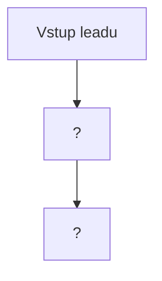

# Fáze 8 — Funnel Flow Audit (end-to-end)

> **Cíl:** Zmapovat skutečný tok leadu od vstupu po draft a najít díry, race conditions, missing pieces.
> **Scope:** Apps Script funkce, frontend akce, Sheets listy — vše relevantní pro tok.

Tento soubor vyplňuje Fáze 8.

---

## A. Mapa toku

### Mermaid diagram

_(vyplní se aktuální tok per repo stav)_

### Per hrana

Pro každou hranu: funkce, trigger, input / output.

---

## B. Přechod po přechodu

Pro každý přechod:

### Přechod: <NAME>

- **Funkce:** `...`
- **Selhání uprostřed:** ?
- **Idempotence:** ?
- **Logging:** ?
- **Rollback:** ?

_(opakovat pro každý přechod)_

---

## C. Missing pieces vs. docs

- Co docs slibuje a kód nedělá
- Co kód dělá a docs nezmiňuje
- Co chybí pro další fáze (preview weby, outbound emails)

---

## D. Dead paths

- Funkce mimo tok
- Stavy do kterých nic nevede

---

## E. Observability

- Jak zjistím stav konkrétního leadu?
- Per-lead audit trail?
- Health check celého funnelu (nic se nezaseklo 24h)
- Alerting

---

## F. Concurrency

- 2 obchodníci editují stejný řádek
- Cron trigger vs obchodník edit
- LockService usage

---

## Findings (FF-XXX)

| ID | Popis | Severity | Evidence |
|----|-------|----------|----------|

Plný seznam v [../FINDINGS.md](../FINDINGS.md).
